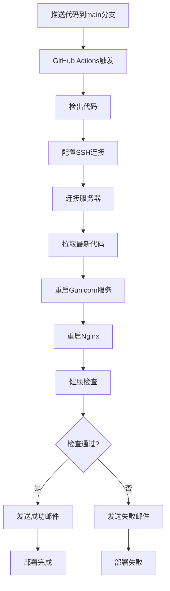

# 🚀 CI/CD 自动部署配置总结

## 📋 配置完成情况

✅ **已创建的文件**:
- `.github/workflows/simple-deploy.yml` - 简化CI/CD工作流
- `SIMPLE_SECRETS_SETUP.md` - GitHub Secrets配置指南
- `test-simple-deploy.sh` - 本地测试脚本

✅ **功能特性**:
- 🚀 **自动部署**: 推送到main分支自动部署
- 🔐 **SSH认证**: 使用SSH密钥安全连接服务器
- 📧 **邮件通知**: 部署成功/失败自动发送邮件
- 🏥 **健康检查**: 部署后自动验证网站可访问性
- ⚡ **快速响应**: 跳过代码质量检查，专注部署

## 🔧 必需的GitHub Secrets

| Secret名称 | 描述 | 状态 |
|-----------|------|------|
| `SERVER_SSH_KEY` | SSH私钥 | ⚠️ 需要配置 |
| `EMAIL_HOST_USER` | 邮件用户名 | ⚠️ 需要配置 |
| `EMAIL_HOST_PASSWORD` | 邮件密码 | ⚠️ 需要配置 |
| `NOTIFICATION_EMAIL` | 通知邮箱 | ⚠️ 需要配置 |

## 🚀 快速开始

### 步骤1: 生成SSH密钥
```bash
# 在服务器上执行
ssh-keygen -t rsa -b 4096 -C "github-actions@shenyiqing.xin"
chmod 700 ~/.ssh
chmod 600 ~/.ssh/id_rsa
chmod 644 ~/.ssh/id_rsa.pub
cat ~/.ssh/id_rsa.pub >> ~/.ssh/authorized_keys
cat ~/.ssh/id_rsa  # 复制此内容到GitHub Secrets
```

### 步骤2: 配置GitHub Secrets
1. 访问GitHub仓库 → Settings → Secrets and variables → Actions
2. 添加以下Secrets:
   - `SERVER_SSH_KEY`: SSH私钥内容
   - `EMAIL_HOST_USER`: 邮件用户名 (如: your-email@gmail.com)
   - `EMAIL_HOST_PASSWORD`: 邮件密码 (如: Gmail应用专用密码)
   - `NOTIFICATION_EMAIL`: 接收通知的邮箱

### 步骤3: 测试部署
```bash
# 推送代码到main分支
git add .
git commit -m "测试自动部署"
git push origin main

# 查看GitHub Actions运行状态
# 检查邮件通知
```

## 📊 部署流程



## 🌐 访问信息

- **IP访问**: http://47.103.143.152
- **域名访问**: http://shenyiqing.xin
- **管理员账号**: admin / admin123

## 📧 邮件通知

部署成功时会发送包含以下信息的邮件：
- 📋 部署信息 (仓库、分支、提交、提交者)
- 🌐 访问地址 (IP和域名)
- 📊 部署状态 (成功/失败)
- 👤 管理员账号信息

## 🔍 监控和维护

### 查看部署状态
- GitHub Actions页面查看运行状态
- 检查邮件通知
- 访问网站验证功能

### 故障排除
```bash
# 检查服务状态
ssh root@47.103.143.152 "systemctl status nginx"
ssh root@47.103.143.152 "ps aux | grep gunicorn"

# 查看日志
ssh root@47.103.143.152 "cd /root/modeshift_django && tail -20 logs/django.log"

# 手动重启服务
ssh root@47.103.143.152 "cd /root/modeshift_django && pkill -TERM -f gunicorn && sleep 2 && nohup venv/bin/gunicorn --bind 0.0.0.0:8000 --workers 3 --timeout 120 wsgi:application --daemon"
```

## 🎯 下一步计划

1. **配置HTTPS**: 添加SSL证书支持
2. **增强监控**: 添加性能监控和告警
3. **备份策略**: 自动数据库备份
4. **回滚功能**: 快速回滚到上一版本

## 📞 支持

如有问题，请：
1. 查看GitHub Actions日志
2. 检查服务器状态
3. 运行本地测试脚本: `./test-simple-deploy.sh`
4. 查看配置指南: `cat SIMPLE_SECRETS_SETUP.md`

---

**🎉 配置完成！现在每次推送代码到main分支都会自动部署到生产环境！**
